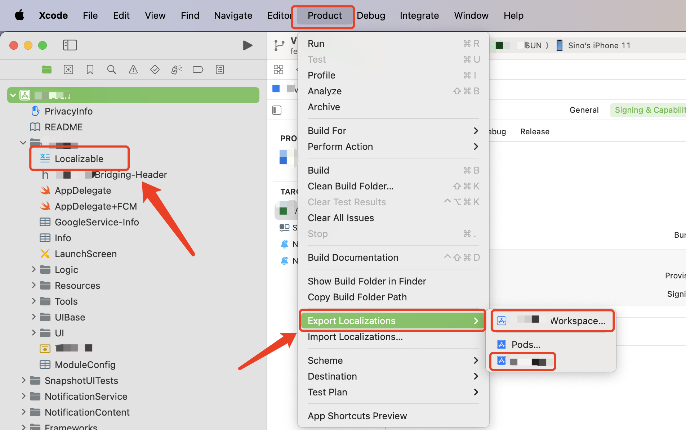
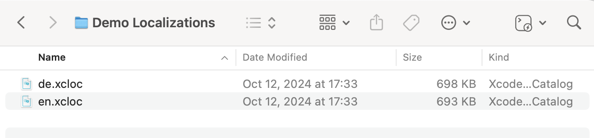
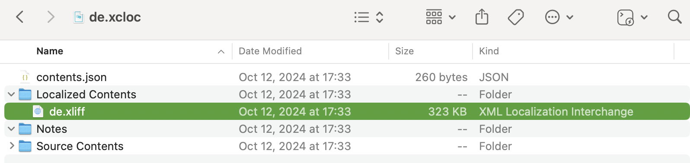
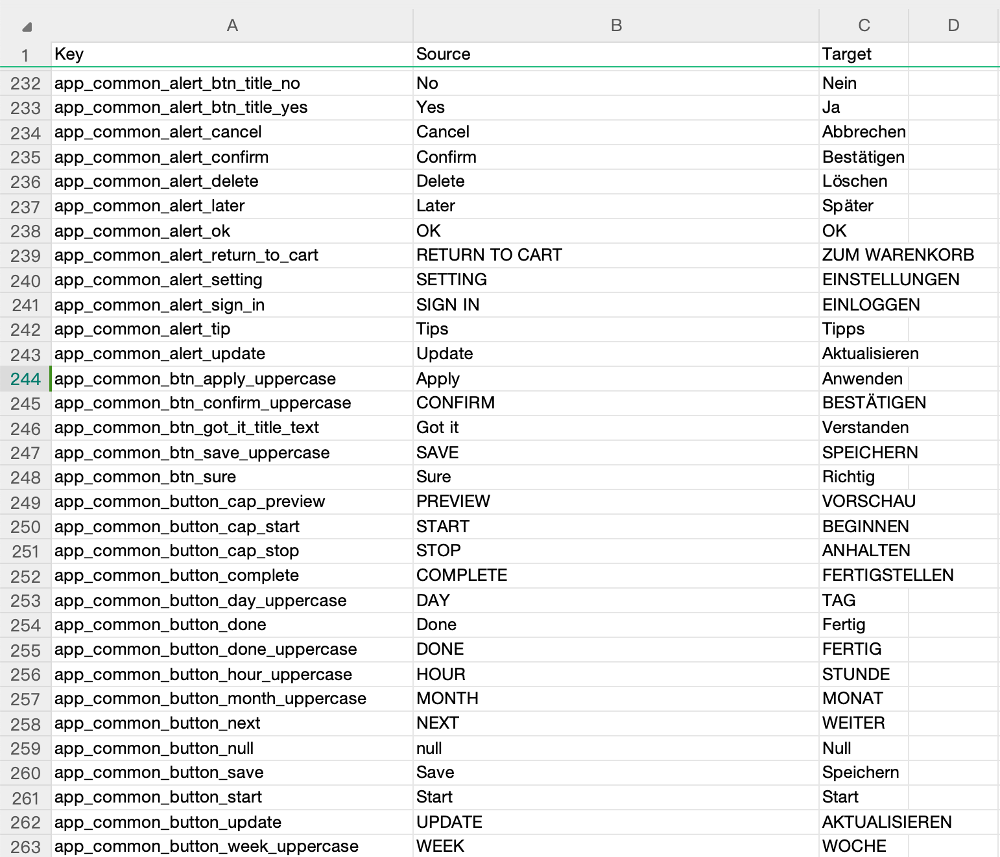

# xcloc-to-excel

将iOS项目（Xcode工程）中本地化文件转化成Excel的表格，供产品经理或翻译方校对。

## 使用说明

1. 支持Xcode15+
2. 默认项目中已经集成本地化配置

### 准备文件

1. 首先导出Xcode项目中的本地化文件，如果导出整个项目中所有的本地化字符串，选择workspace
    否则只需要选择需要的Target即可。

    ```text
    "Product -> Export Localizations -> Workspace / Project"
    
    ```

    

2. 导出的时候可以选择自己需要的语言，并在指定的目录生成一个文件夹，包含多个xcloc文件。
    
    本质上xcloc文件是一个压缩文件，可以通过右键Show Package Contents的方式显示包内容。
    
    可以看到核心文件是基于XML格式的xliff文件。

3. 此xliff文件通过```poedit```等软件打开并操作编辑，一般情况下可以直接将此文件交给翻译同学校对。然而不要问为什么不是提供xiff文件，因为有需求方想要表格更直观，那么就可以通过此仓库中的脚本进行转换了。

### 执行脚本

1. 安装python环境 & pip包依赖管理工具

    ```shell
     brew install python3
    ```

2. 切换虚拟环境并安装依赖

    ```bash
    #在本地目录创建虚拟环境
    python3 -m venv path/to/venv
    source path/to/venv/bin/activate
    
    #安装依赖
    python3 -m pip install argparse
    python3 -m pip install xlrd
    python3 -m pip install openpyxl
    ```

3. 执行python脚本

    ```bash
    #切换到当前目录
    cd path/to/this
    
    #执行当前文件(替换路径参数)
    python3 xcloc2excel.py /path/to/your/xcloc_folder /path/to/output/excel_file.xlsx
    ```

    注：
     - 替换 /path/to/your/xcloc_folder 为你的 .xcloc 文件夹的实际路径。
     - 替换 /path/to/output/excel_file.xlsx 为你希望生成的 Excel 文件的路径。

    ```bash
     python3 xcloc2excel.py /Users/soul/Downloads/Localizations/de.xcloc ~/Desktop/output.xlsx
     ```

4. 查看输出目录中生成的文件
   
    如果没有成功输出文件，请先检查第一个参数一定是以xcloc结尾的绝对路径，然后检查第二个参数一定是以xlsx结尾的绝对路径。
